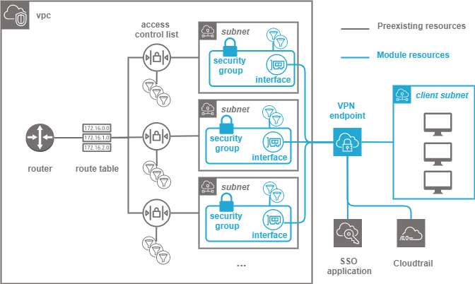

.. image:: docs/imgs/logo.png
   :alt: Logo

=============================
Technogix vpn endpoint module
=============================

About The Project
=================

This project contains all the infrastructure as code (IaC) to deploy a secure VPN endpoint in an AWS VPC

.. image:: https://badgen.net/github/checks/technogix-terraform/module-aws-vpn-endpoint
   :target: https://github.com/technogix-terraform/module-aws-vpn-endpoint/actions/workflows/release.yml
   :alt: Status
.. image:: https://img.shields.io/static/v1?label=license&message=MIT&color=informational
   :target: ./LICENSE
   :alt: License
.. image:: https://badgen.net/github/commits/technogix-terraform/module-aws-vpn-endpoint/main
   :target: https://github.com/technogix-terraform/robotframework
   :alt: Commits
.. image:: https://badgen.net/github/last-commit/technogix-terraform/module-aws-vpn-endpoint/main
   :target: https://github.com/technogix-terraform/robotframework
   :alt: Last commit

Built With
----------

.. image:: https://img.shields.io/static/v1?label=terraform&message=1.1.7&color=informational
   :target: https://www.terraform.io/docs/index.html
   :alt: Terraform
.. image:: https://img.shields.io/static/v1?label=terraform%20AWS%20provider&message=4.4.0&color=informational
   :target: https://registry.terraform.io/providers/hashicorp/aws/latest/docs
   :alt: Terraform AWS provider

Getting Started
===============

Prerequisites
-------------

A virtual private cloud structure shall exist in order to integrate the vpn endpoint into a wider network.
One or more subnets shall have been created to receive the vpn (see `technogix subnet module`_)

In order to create the vpn, some main information are required :

* The cidr range in which the endpoints shall use to get IP (shall not overlap VPC range)

* The flows that shall be allowed inside or outside of the vpn endpoint in order to declare the security group

* An SSO application shall have been created to connect the VPN, and its associated saml shall have been produced

* A loggroup shall have been created to receive logs

.. _`technogix subnet module`: https://github.com/technogix-terraform/module-aws-subnet

Configuration
-------------

To use this module in a wider terraform deployment, add the module to a terraform deployment using the following module:

.. code:: terraform

    module "vpn" {

        source       = "git::https://github.com/technogix-terraform/module-aws-vpn-endpoint?ref=<this module version"
        project      = the project to which the permission set belongs to be used in naming and tags
        module       = the project module to which the permission set belongs to be used in naming and tags
        email        = the email of the person responsible for the permission set maintainance
        environment  = the type of environment to which the permission set contributes (prod, preprod, staging, sandbox, ...) to be used in naming and tags
        git_version  = the version of the deployment that uses the permission sets to be used as tag
        vpc          = {
            id             = the aws id of the virtual private cloud in which the vpn shall be deployed
            cidr           = the aws vpc route cidr block
        }
        logging      = {
            loggroup       = name of the loggroup in which logas shall be rerouted
        }
        vpn          = {
            name           = the name to give to the VPN
            certificate    = the arn of the certificate to use to encrypt vpn communications
            cidr           = the cidr range to attribute local ip address to VPN client (shall not overlap the VPC cidr)
            saml           = the xml content of the SSO application SAML to identify in the technogix aws portal
            group          = the identifier of the SSO group to allow VPN access
            authorizations = the list of cidr to give access authorizations through VPN
        }
        subnets      = [ the list of subnets through which vpn users can access vpc services
            {
                id         = identifier of the subnet to associate
                routes     = routes to create between VPN and other services through this subnet
            }
        ]
        rules        = {
            egress     = [ the list of security group rules to allow flows outside the VPN
               { name="allowtls", cidr = "0.0.0.0/0", from = 443,   to = 443,   protocol = "tcp"}
            ]
            ingress   = [ *the list of security group rules to allow flows inside the VPN
               { name="allowtls", cidr = "0.0.0.0/0", from = 443,   to = 443,   protocol = "tcp"}
            ]
         }
    }

Usage
-----

The module is deployed alongside the module other terraform components, using the classic command lines :

.. code:: bash

    terraform init ...
    terraform plan ...
    terraform apply ...

Detailed design
===============

The module creates an endpoint and enable authentication through SSO by setting up a federated authentication using the provided SAML document.
Logs and access logs are redirected to an external cloudwatch loggroup.

Authorizations are given to VPN users to enter VPC services (such as internet, and the VPN receiving subnets).
One subnet is enough for simple deployments, but if fault tolerance is arequirement, the VPN can be configured to access
networks in different availability zones.

A security group is created to filter network flows at endpoint level.

The endpoint then access to its associated subnet, but to allow access to other vpc services, configuring the endpoint security group is not enough,
since the network flow are still filtered by the receiving subnets network access control lists. Nacl rules will have to be created from
receiving subnet to the required services in order to allow communication.

.. important::
    Security groups are stateful, meaning you shall only build rule to allow :

    * The egress requests to any location outside of the subnet

    * The ingress requests from any location outside of the subnet

   The response will automatically be allowed through security group

Testing
=======

Tested With
-----------

.. image:: https://img.shields.io/static/v1?label=technogix_iac_keywords&message=v1.0.0&color=informational
   :target: https://github.com/technogix-terraform/robotframework
   :alt: Technogix iac keywords
.. image:: https://img.shields.io/static/v1?label=python&message=3.10.2&color=informational
   :target: https://www.python.org
   :alt: Python
.. image:: https://img.shields.io/static/v1?label=robotframework&message=4.1.3&color=informational
   :target: http://robotframework.org/
   :alt: Robotframework
.. image:: https://img.shields.io/static/v1?label=boto3&message=1.21.7&color=informational
   :target: https://boto3.amazonaws.com/v1/documentation/api/latest/index.html
   :alt: Boto3

Environment
-----------

Tests can be executed in an environment :

* in which python and terraform has been installed, by executing the script `scripts/robot.sh`_, or

* in which docker is available, by using the `technogix infrastructure image`_ in its latest version, which already contains python and terraform, by executing the script `scripts/test.sh`_

.. _`technogix infrastructure image`: https://github.com/technogix-images/terraform-python-awscli
.. _`scripts/robot.sh`: scripts/robot.sh
.. _`scripts/test.sh`: scripts/test.sh

Strategy
--------

The tests currently contains no test, since it is very long to create a vpn endpoint, and so we'd rather switch directly to integrated tests :

Results
-------

N.A.

Issues
======

.. image:: https://img.shields.io/github/issues/technogix-terraform/module-aws-vpn-endpoint.svg
   :target: https://github.com/technogix-terraform/module-aws-vpn-endpoint/issues
   :alt: Open issues
.. image:: https://img.shields.io/github/issues-closed/technogix-terraform/module-aws-vpn-endpoint.svg
   :target: https://github.com/technogix-terraform/module-aws-vpn-endpoint/issues
   :alt: Closed issues

Roadmap
=======

N.A.

Contributing
============

.. image:: https://contrib.rocks/image?repo=technogix-terraform/module-aws-vpn-endpoint
   :alt: GitHub Contributors Image

We welcome contributions, do not hesitate to contact us if you want to contribute.

License
=======

This code is under MIT License.

Contact
=======

Technogix - contact.technogix@gmail.com

Project Link: `https://github.com/technogix-terraform/module-aws-vpn-endpoint`_

.. _`https://github.com/technogix-terraform/module-aws-vpn-endpoint`: https://github.com/technogix-terraform/module-aws-vpn-endpoint

Acknowledgments
===============

N.A.
